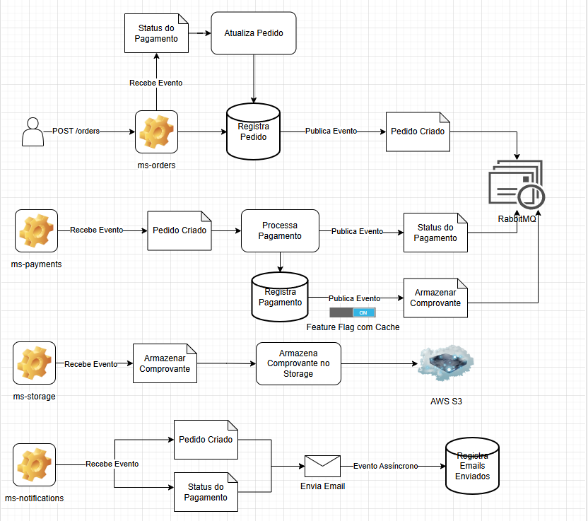
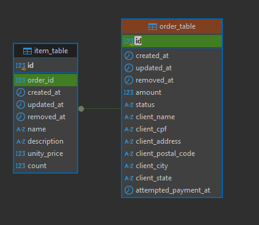

# Microsserviço de Criação de Pedido 
Este projeto é um microsserviço responsável pela criação de pedidos e faz parte de um sistema distribuído de gerenciamento
de pedidos.

Acesse a [Documentação de Integração Swagger](https://gildevan-pereira.github.io/order-management-orders-swagger/)

# Sobre o Fluxo
O sistema recebe uma requisição HTTP para criação de um pedido, registra no banco principal e no banco de histórico,
e por fim, publica uma mensagem para a fila do RabbitMQ que será consumida pelo microsserviço de pagamentos. Este, por
sua vez, deverá devolver um evento de atualização de status do pedido após o processamento do pagamento, e assim será 
atualizado o status e data do processamento no banco principal e no banco de histórico.

# Funcionalidades
- Criar Pedido 

> Salva o pedido no banco de dados e publica um evento de ordem criada no rabbitmq

- Atualizar pedido

> Recebe um evento com o resultado do processamento do pagamento e atualiza a ordem nos bancos de dados.
  Se ocorrer um erro no processamento da mensagem, o microsserviço possui uma resiliência para executar até 3 tentativas.
  Após isso, se ainda não houver sucesso, a mensagem é encaminhada para uma fila morta monitorada.

- Salvar Histórico

> O registro de histórico é mantém todas as atualizações de uma ordem desde a sua criação até o resultado final.
  Estes registros são mantidos em um banco secundário não relacional, para não comprometer o banco principal da aplicação
  com grandes volumes de dados de históricos.

- Busca por ID
        
> A busca por ID retorna a ordem que esteja associada ao ID informado.

- Busca por Filtros

> A busca por filtros é realizada passando combinação de filtros específicos como ids, data, valor, etc. 
  A consulta retorna os dados paginados e o tamanho e ordenação dos resultados também podem ser enviados na requisição.

- Busca de Histórico por ID- 

> A busca de histórico por ID retorna todos os registros de uma ordem específica desde sua criação até o estado final.

# Diagramas

A baixo segue o diagrama da arquitetura do sistema:

Seque o diagrama do modelo de dados com as entidades deste microsserviço:

# Tecnologias

Este projeto utiliza as seguintes tecnologias:

- Java 21
- Spring Boot
- Spring Data & JPA
- Bean Validation
- Maven
- Lombok
- ModelMapper
- RabbitMQ
- PostgreSQL
- MongoDB
- Flyway
- JUnit
- Mockito

# Como Executar

Após clonar este repositório, você vai precisar ter instalado o [Docker](https://www.docker.com/products/docker-desktop/)
e em seguida criar em seu ambiente local, os containers os bancos de dados e o rabbitmq. Para isso use o comando abaixo
no diretório raiz do projeto:

    docker-compose up -d

Após isso abra o projeto em uma IDE de sua preferência e execute.

> Obs.: No arquivo ``application.yml`` você encontrará diversas variaveis de ambiente que podem ser configuradas de acordo com as 
suas necessidades, porém, todas já possuem valores padrão que correspondem ao que está configurado nos containers.