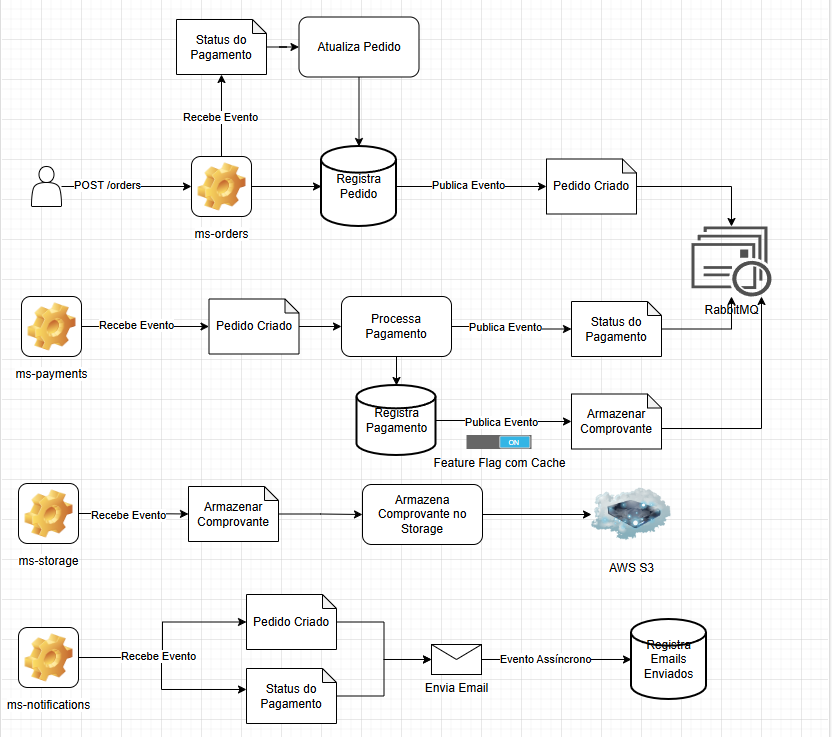

# Microsserviço de Criação de Pedido 
Este projeto é um microsserviço de um sistema distribuido que gerencia um fluxo de criação e aprovação de pedidos.

## Índice
- [Sobre o Projeto](#sobre-o-projeto)
  - [Funcionalidades](#funcionalidades)
  - [Tecnologias](#tecnologias)
  - [Diagrama](#diagrama)
- [Instalação](#instalação)

## Sobre o Projeto
Quando o pedido é criado, um evento é disparado, enviando uma mensagem para a fila do RabbitMQ, que será consumida pelo
microsserviço de pagamentos que em seguida irá devolver um evento de atualização de status do pedido. 

Durante esse processo, também é salvo no banco NoSql, o histórico da ordem, que são exatamente os mesmos dados.
Isso acontece tanto na criação do pedido quanto na atualização do status. Isso serve para garantir que cada pedido tenha
um histórico do estado anterior a qualquer atualização, assim deixando uma forma de auditar o fluxo da transação sem 
perder informações após atualizar o dado no banco SQL;

### Funcionalidades
- Criar Pedido 

> Salva o pedido no banco de dados e publica o evento de criação de ordem no rabbitmq

- Atualizar pedido

> Recebe o evento de confirmação ou rejeição do pagamento e atualiza a ordem no banco de dados.
  Se o dado vier inválido, será enviado o evento para uma fila morta, mas se houver outro problema como falha de 
  conexão, a aplicação irá fazer a retentativa 3 vezes e depois enviará para a fila morta.

- Salvar Histórico

> O histórico é o mesmo objeto que é salvo no banco SQL, é um registro de todas as alterações que a ordem sofreu.
  O salvamento acontece na criação de ordem e na atualização após a confirmação ou recusa do pagamento, portanto 
  não existe um método específico para essa ação.

- Busca por ID
        
> A busca por ID tráz a transação que esteja associada ao ID informado

- Busca por Filtro

> A busca por filtro é realizada passando filtros específicos no parãmetro da requisição. 
  O filtro trará todos os registros que possuídem as informações passadas no filtro

- Busca de Histórico por ID- 

> O resultado da busca de histórico por ID, é uma lista que contém o mesmo objeto em estados diferentes, então o 
  mesmo id pode haver mais de um registro, trazendo assim uma lista da mesma ordem, porem a busca é realizada pelo
  orderId, ou seja o id do pedido e não do registro do histórico.

### Tecnologias

Este projeto contempla o uso das seguintes tecnologias:

- Java 21
- Spring Boot
- Spring Data & JPA
- Spring Validation
- Maven
- Lombok
- ModelMapper
- Arquitetura de Microsserviços
- RabbitMQ
- PostgreSQL
- MongoDB
- Flyway
- JUnit
- Mockito

### Diagrama

A baixo você verá o diagrama de todo o fluxo desse microsserviço e de todo o ecossistema:

## Instalação

Para rodar este projeto, você irá precisar de algumas tecnologias que serão listadas a seguir.
As configurações são definidar com variaveis de ambiente, então você pode definir os dados de acesso como quiser ou
alterar no application.yml.

###### Pré-requisitos

Após clonar este repositório, você vai precisar de:

``Docker``

    https://www.docker.com/products/docker-desktop/

Após ter instalado o Docker execute o comando a seguir para configurar seu ambiente automaticamente:

    docker-compose up --build

Essa configuração irá configurar o projeto com as tecnologias a baixo:

``Java``

``Maven``

``PostgreSQL``

``MongoDB``

``RabbitMQ``
